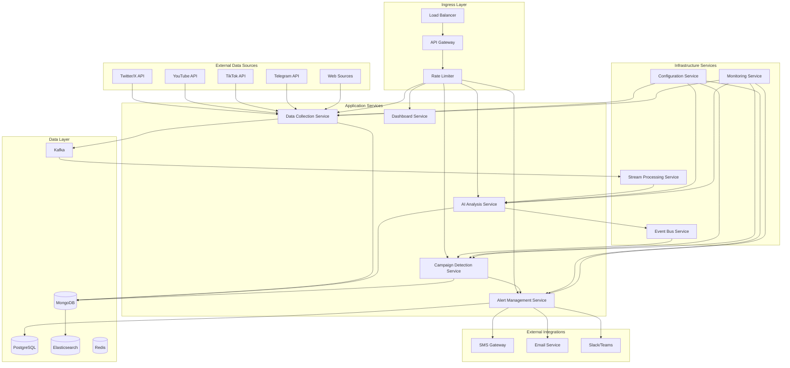
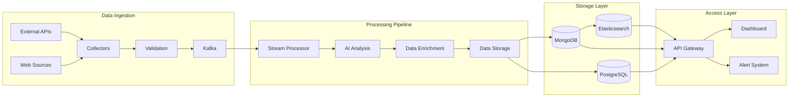

# Project Dharma - System Architecture

## Overview

Project Dharma is a comprehensive AI-powered social media monitoring platform designed to detect, analyze, and track coordinated disinformation campaigns across multiple digital platforms. The system employs a microservices architecture with real-time data processing, advanced AI/NLP analysis, and comprehensive monitoring capabilities.

## Architecture Principles

### 1. Microservices Architecture
- **Service Independence**: Each service can be developed, deployed, and scaled independently
- **Technology Diversity**: Services can use different technologies best suited for their purpose
- **Fault Isolation**: Failure in one service doesn't cascade to others
- **Team Autonomy**: Different teams can own different services

### 2. Event-Driven Design
- **Asynchronous Communication**: Services communicate through events and message queues
- **Loose Coupling**: Services are decoupled through event contracts
- **Scalability**: Event-driven systems can handle high throughput
- **Resilience**: Built-in retry and dead letter queue mechanisms

### 3. Cloud-Native Principles
- **Containerization**: All services run in Docker containers
- **Orchestration**: Kubernetes for container orchestration and scaling
- **Infrastructure as Code**: Terraform for infrastructure provisioning
- **Observability**: Comprehensive monitoring, logging, and tracing

## High-Level Architecture

## Core Services

### 1. Data Collection Service
**Purpose**: Collect data from multiple social media platforms and web sources

**Key Components**:
- Platform-specific collectors (Twitter, YouTube, TikTok, Telegram)
- Web scraping engine with respectful rate limiting
- Data validation and preprocessing pipeline
- Kafka producer for streaming data

**Technologies**:
- Python 3.11+ with asyncio for concurrent processing
- Tweepy for Twitter API integration
- Google API Client for YouTube
- Telethon for Telegram
- aiohttp + BeautifulSoup for web scraping
- Kafka Python client for message streaming

**Scaling Strategy**:
- Horizontal scaling based on data volume
- Platform-specific worker pools
- Rate limiting per data source
- Circuit breaker pattern for API failures

### 2. AI Analysis Service
**Purpose**: Process collected data through AI/ML models for sentiment analysis and bot detection

**Key Components**:
- Sentiment analysis using fine-tuned BERT models
- Bot detection with behavioral analysis
- Multi-language NLP support
- Model governance and lifecycle management

**Technologies**:
- PyTorch/Transformers for deep learning models
- scikit-learn for traditional ML algorithms
- spaCy for NLP preprocessing
- MLflow for model versioning and tracking
- ONNX for model optimization

**Scaling Strategy**:
- GPU-based horizontal scaling for model inference
- Model serving with batching for efficiency
- A/B testing framework for model updates
- Automated model retraining pipelines

### 3. Campaign Detection Service
**Purpose**: Identify coordinated disinformation campaigns using graph analysis

**Key Components**:
- Content similarity analysis
- Network graph construction and analysis
- Temporal pattern detection
- Campaign scoring and classification

**Technologies**:
- NetworkX for graph analysis
- Sentence Transformers for content similarity
- scikit-learn for clustering algorithms
- Neo4j for graph database (optional)

**Scaling Strategy**:
- Distributed graph processing
- Incremental analysis for real-time detection
- Caching of computed similarities
- Parallel processing of time windows

### 4. Alert Management Service
**Purpose**: Generate, route, and manage alerts based on analysis results

**Key Components**:
- Alert generation engine with severity classification
- Multi-channel notification service
- Alert deduplication and correlation
- Escalation workflows and SLA tracking

**Technologies**:
- FastAPI for REST API
- Celery for background task processing
- Twilio for SMS notifications
- SendGrid for email notifications
- WebSocket for real-time dashboard updates

**Scaling Strategy**:
- Queue-based processing for high alert volumes
- Channel-specific worker pools
- Rate limiting for external notifications
- Priority-based alert routing

### 5. Dashboard Service
**Purpose**: Provide interactive web interface for analysts and administrators

**Key Components**:
- Real-time metrics dashboard
- Campaign investigation interface
- Alert management console
- User and role management

**Technologies**:
- Streamlit for rapid dashboard development
- React.js for advanced interactive components
- Plotly for data visualization
- WebSocket for real-time updates

**Scaling Strategy**:
- CDN for static assets
- Session-based load balancing
- Caching of dashboard data
- Progressive loading for large datasets

## Infrastructure Services

### Event Bus Service
**Purpose**: Facilitate asynchronous communication between services

**Components**:
- Kafka cluster for high-throughput messaging
- Schema registry for event contract management
- Dead letter queues for failed message processing
- Event sourcing for audit trails

### Stream Processing Service
**Purpose**: Real-time data processing and analysis

**Components**:
- Kafka Streams for stream processing
- Apache Flink for complex event processing (optional)
- Real-time aggregations and windowing
- Stream monitoring and alerting

### Configuration Service
**Purpose**: Centralized configuration and service discovery

**Components**:
- Consul for service discovery
- Vault for secrets management
- Feature flags for gradual rollouts
- Environment-specific configurations

### Monitoring Service
**Purpose**: System observability and health monitoring

**Components**:
- Prometheus for metrics collection
- Grafana for visualization
- Jaeger for distributed tracing
- ELK stack for centralized logging

## Data Architecture

### Data Storage Strategy

#### MongoDB (Primary Data Store)
- **Purpose**: Store unstructured social media posts and analysis results
- **Collections**: posts, users, campaigns, analysis_results
- **Scaling**: Sharding by platform and time-based partitioning
- **Indexing**: Compound indexes on timestamp, platform, and analysis fields

#### PostgreSQL (Relational Data)
- **Purpose**: Store structured data like users, alerts, and audit logs
- **Tables**: users, roles, alerts, audit_logs, system_config
- **Scaling**: Read replicas and connection pooling
- **Backup**: Continuous WAL archiving and point-in-time recovery

#### Elasticsearch (Search and Analytics)
- **Purpose**: Full-text search and real-time analytics
- **Indices**: posts-*, campaigns-*, alerts-*
- **Scaling**: Multi-node cluster with proper shard allocation
- **Retention**: Time-based index lifecycle management

#### Redis (Caching and Sessions)
- **Purpose**: Application caching and session management
- **Usage**: API response caching, user sessions, rate limiting
- **Scaling**: Redis Cluster for high availability
- **Persistence**: RDB snapshots with AOF for durability

### Data Flow Architecture

## Security Architecture

### Authentication and Authorization
- **JWT-based authentication** with refresh token rotation
- **Role-based access control (RBAC)** with fine-grained permissions
- **Multi-factor authentication (MFA)** for administrative access
- **API key management** for service-to-service communication

### Data Protection
- **Encryption at rest** using AES-256 for sensitive data
- **Encryption in transit** using TLS 1.3 for all communications
- **Data anonymization** for compliance with privacy regulations
- **Audit logging** for all data access and modifications

### Network Security
- **VPC isolation** with private subnets for internal services
- **Web Application Firewall (WAF)** for external-facing endpoints
- **DDoS protection** through cloud provider services
- **Network segmentation** with security groups and NACLs

## Deployment Architecture

### Container Strategy
- **Multi-stage Docker builds** for optimized image sizes
- **Distroless base images** for reduced attack surface
- **Security scanning** integrated into CI/CD pipeline
- **Image signing** and vulnerability management

### Orchestration
- **Kubernetes** for container orchestration
- **Helm charts** for application packaging
- **GitOps** with ArgoCD for deployment automation
- **Blue-green deployments** for zero-downtime updates

### Infrastructure as Code
- **Terraform** for cloud infrastructure provisioning
- **Ansible** for configuration management
- **Packer** for custom AMI/image creation
- **Version control** for all infrastructure code

## Scalability and Performance

### Horizontal Scaling Strategies
- **Auto-scaling groups** based on CPU, memory, and custom metrics
- **Load balancing** with health checks and circuit breakers
- **Database sharding** and read replicas
- **CDN integration** for static content delivery

### Performance Optimization
- **Connection pooling** for database connections
- **Caching strategies** at multiple layers (application, database, CDN)
- **Async processing** for non-blocking operations
- **Batch processing** for bulk operations

### Monitoring and Alerting
- **SLA/SLO definitions** with error budgets
- **Custom metrics** for business logic monitoring
- **Automated alerting** based on thresholds and anomalies
- **Performance profiling** and bottleneck identification

## Disaster Recovery and High Availability

### Backup Strategy
- **Automated daily backups** with retention policies
- **Cross-region replication** for critical data
- **Point-in-time recovery** capabilities
- **Backup testing** and restoration procedures

### High Availability Design
- **Multi-AZ deployment** for database and application tiers
- **Active-passive failover** for critical services
- **Health checks** and automatic failover mechanisms
- **Graceful degradation** during partial outages

### Business Continuity
- **RTO target**: 4 hours for full system recovery
- **RPO target**: 1 hour maximum data loss
- **Disaster recovery drills** conducted quarterly
- **Incident response procedures** and runbooks